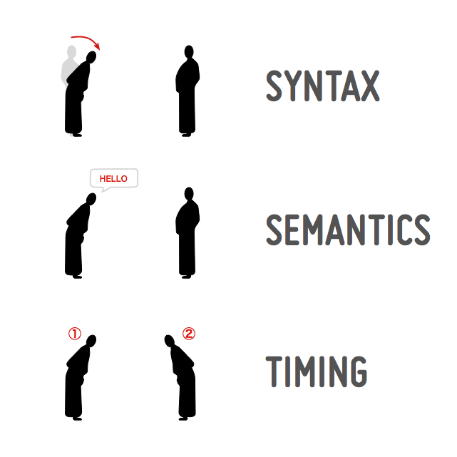

HTTP - بروتوكول على مستوى طبقة التطبيقات
====================================
##مقدّمة
إذا التقى شخصان في قرى الهيمالايا، حيِّا أحدهما الآخر قائلًا: "هل جسدك معافى؟" وأما في اليابان فقد ينحنيان أحيانًا، وفي عُمان يطبع كلّ منهما قبلة على أنف الآخر بعد التصافح، في كمبوديا وتايلاند، يضمّ كلّ منهما يديه وكأنّه يدعو. كل هذه الوسائل هي "بروتوكولات" للتواصل، أي سلسلة بسيطة من الرموز ذات المعنى والّتي تمهّد لتبادل حديث مُفيد.

في عالم الويب، لدينا بروتوكول فعّال جدًّا على مستوى التّطبيقات يُمهّد الحواسيب حول العالم لتبادل الأحاديث النّافعة، واسمه [Hypertext Transfer Protocol](https://en.wikipedia.org/wiki/HTTP)، أو HTTP اختصارًا؛ وهو بروتوكول يُصنّف ضمن طبقة التّطبيقات فوق [TCP/IP](https://en.wikipedia.org/wiki/TCP/IP_model)، وهو أيضًا بروتوكول للتواصل. كثيرًا ما يغيب شرح HTTP في دروس التصميم والتطوير للويب، وهذا أمرٌ مُخزٍ: ففهمه يُعينك في تحسين تفاعل المستخدم وتحقيق أداء أفضل للموقع وإنشساء أدوات فعّالة لإدارة المعلومات على الويب.

هذا المقال هو الجزء الأول من سلسلة تهدف إلى تعليم أساسيّات HTTP، وكيف يمكن استخدامه بفعّاليّة أكبر. سنطّلع في هذا الدّرس على محلّ HTTP من الإنترنت.

##ما معنى بروتوكول تواصل؟
قبل الدّخول في التفاصيل، لنتخيّل موقفًا بسيطًا يحدث فيه تواصل بين طرفين، ولكي يحدث هذا التواصل، فإن على الطّرفين (برنامجين كانا أم جهازين أم شخصين... إلخ.) أن يتّفقا على:

* الصياغة (تنسيق البيانات)
* الدلالات (معلومات التحكم والتعامل مع الأخطاء)
* التوقيت (تطابق السرعة والتتالي)

عندما يلتقى اثنان، فإنّهما يتفاهمان من خلال بروتوكل تواصل: ففي اليابان مثلًا، يؤدي أحدهما حركة جسدية، كأن يحني ظهره. وهذه هي **الصياغة** المعتمدة في التواصل. وفي عادات اليابان، **تدل** حركة الانحناء هذه (وحركات أخرى مشابهة) على التّحيّة. وبحركة انحناء أحد الشخصين للآخر تنطلق سلسلة من الأحداث بينهما **مرتبة بتوقيت** معيّن.



يتركّب بروتوكل التواصل عبر الشبكات من المكوّنات ذاتها. فأمّا الصّياغة فهي سلسلة من الحروف كالكلمات المفتاحيّة المُستخدمة في كتابة البروتوكول، وأمّا الدلالات فهي المعاني المُرتبطة بكلّ من هذه الكلمات، وأمّا التوقيت فهو ترتيب تبادل هذه الكلمات بين الطّرفين.

##ما محلّ HTTP من الإنترنت؟
يقوم HTTP نفسه فوق بروتوكولات أخرى. فعند الاتصال بموقع ويب مثل `www.example.org`، يستخدم وكيل المستخدم (user agent) مجموعة بروتوكولات [TCP/IP](http://en.wikipedia.org/wiki/TCP/IP_model)، والتي صُمّمت في عام 1970 مؤلّفة من [4 طبقات](https://tools.ietf.org/html/rfc1122):

1. طبقة **الوصلة (Link)**، والتي تصف الوصول إلى الوسيط المادّي (كاستخدام بطاقة الشبكة مثلًا)
2. طبقة **الإنترنت**، والتي تصف كيفيّة تغليف البيانات وتوجيهها (IP أو Internet Protocol)
3. طبقة **النقل (Transport)**، والتي تصف كيفية نقل البيانات من نقطة الانطلاق إلى الوجهة (TCP وUDP)
4. طبقة **التطبيقات (Application)**، والتي تصف معنى وصياغة الرسائل المنقولة (HTTP)

فـHTTP إذًا هو **بروتوكول على مستوى التطبيقات** يقوم على الطبقات السابقة، لا تنسَ هذه الفكرة. يُساعد فصل هذا النّموذج في طبقات على تطوير أجزاءه بصورة منفصلة دون الحاجة لإعادة تصميمها جميعًا. فمثلًا، يمكن تطوير TCP، باعتباره بروتوكولًا في طبقة النّقل، دون الحاجة لتعديل HTTP كونه برتوكولًا في طبقة التّطبيقات. لكن الواقع العمليّ يجعل التفاصيل أكثر تعقيدًا عند الحاجة للوصول إلى تواصل ذي أداء عالٍ. سنركّز في الأجزاء الأولى من هذه السّلسلة على فصل الطّبقات كما هو مُعرَّف في نموذج TCP/IP.

صُمِّم HTTP بغرض تبادل المعلومات بين برنامجين من خلال رسائل تُسمّى رسائل HTTP، وتؤثّر طريقة تشكيل هذه الرسائل في العميل (client) والخادوم (server) والأطراف الوسيطة (كالخواديم الوكيلة proxies).

##لنتواصل مع خادوم!
يُعتبر المنفذ رقم 80 المنفذ المبدئيّ للاتّصال بخواديم الويب، ويمكن التأكّد من ذلك بتجربة نُجريها من الطّرفيّة. افتح الطّرفية (أو سطر الأوامر) وجرّب الاتصال بـ`www.opera.com` على المنفذ 80 مُستخدمًا الأمر التالي:

```bash
telnet www.opera.com 80
```

من المُفترض أن يكون الناتج:

```
Trying 195.189.143.147...
Connected to front.opera.com.
Escape character is '^]'.
Connection closed by foreign host.
```

كما نرى فإن الطرفيّة تحاول الاتصال بالخادوم ذي عنوان IP‏ `195.189.143.147`. إن لم نفعل شيئًا آخر سيغلق الخادوم الاتصال بنفسه. من الممكن بالطّبع استخدام منفذ آخر بل وحتّى بروتوكول تواصل آخر، ولكن هذه هي الإعدادات الشّائعة.

##لنتحدّث بلغة HTTP!
لنحاول ثانية التواصل مع الخادوم. أدخل الرسالة التالية في الطرفية (أو سطر الأوامر):

```bash
telnet www.opera.com 80
```

ما إن يُؤسّس الاتصال، اكتب رسالة HTTP التالية بسرعة (قبل أن يُغلق الخادوم الاتصال بنفسه)، ثم اضغط Enter مرّتين:

```
GET / HTTP/1.1
Host: www.opera.com
``

تُحدّد هذه الرسالة:

* `GET`: أي أننا نريد "الحصول على" تمثيل البيانات.
* `/`: أي أنّ المعلومات التي نريدها مخزنة في جذر الموقع.
* `HTTP/1.1`: أي أننا نتحدث ببروتوكول HTTP ذي الإصدارة 1.1.
* `Host:`: أي أننا نريد الوصول إلى الموقع المُحدّد.
* `www.opera.com`: اسم الموقع هو www.opera.com.

على الخادوم الآن أن يُجيب طلبنا. من المفترض أن تمتلئ نافذة الطرفية بمحتوى مشابه لما يلي:

```
HTTP/1.1 200 OK
Date: Wed, 23 Nov 2011 19:41:37 GMT
Server: Apache
Content-Type: text/html; charset=utf-8
Set-Cookie: language=none; path=/; domain=www.opera.com; expires=Thu, 25-Aug-2011 19:41:38 GMT
Set-Cookie: language=en; path=/; domain=.opera.com; expires=Sat, 20-Nov-2021 19:41:38 GMT
Vary: Accept-Encoding
Transfer-Encoding: chunked

<!DOCTYPE html>
<html lang="en">
…
``

يقول الخادوم هنا: "أنا أتحدث HTTP الإصدارة 1.1. نجحَ طلبك، لذا أجبت بالرمز `200`." الكلمة `OK` ليست إلزامية والهدف منها شرح معنى الرمز للبشر - وهي تُشير في حالتنا إلى أن الأمور تسير على ما يرام وأن رسالتنا قُبلت. يلي ذلك سلسلة من "ترويسات HTTP" التي تُرسل لتصف الرسالة، وكيف يجب أن تُفهم. أخيرًا نجد محتويات الصفحة المُستضافة على جذر الموقع، والّتي تبدأ بـ`<!DOCTYPE html>`. سنشرح قائمة أفعال HTTP ورموزه في المقالات القادمة.


##الخلاصة
لقد تحدثنا بلغة HTTP. ليس الأمر صعبًا! أرسلنا رسالة (تشبه الرسائل التقليدية على الورق) ووصلنا جواب يدل على أن رسالتنا مفهومة. سنشرح في الجزء القادم ما تعنيه بعض هذه الترويسات وفائدة استخدامها.

ترجمة (بشيء من التّصرّف) لمقال [HTTP — an Application-Level Protocol](https://dev.opera.com/articles/http-basic-introduction/) لصاحبه Karl Dubosy.
