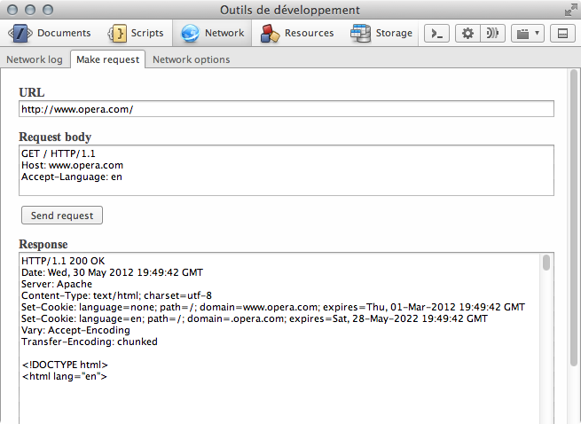

HTTP - لننطلق!
==================

##مقدّمة
تعلمنا في الجزء السابق أن HTTP بروتوكول على مستوى التطبيقات. حان الوقت لنفهم كيفية استخدام هذا البروتوكول للتواصل بين العميل والخادوم.

##جلب الأشياء من الويب
تذكر أن عميل HTTP (وهو المتصفح عادةً) هو الطرف الذي يبدأ بإرسال الطلب إلى الخادوم. يسمح بروتوكول HTTP للعميل بالتعبير عن نيّته من خلال بضعة مُكوّنات: الرابط (URI)، وأفعال HTTP، وترويساته.

###تسمية الأشياء
تمثّل الروابط (URIs) حجر الأساس في الويب، لأنّها تحل مشكلة مهمّة على مستوى الإنترنت بكاملها، وهي مشكلة منح الأشياء **مُعرّفًا تنفرد به** على الشّبكة.

افترض أنّك سألت شخصًا أن يجلب لك شيئًا ويُحضره إليك، يمكن عدّ الطرق الممكنة للطلب على الأصابع. فعادةً ما تُعرّف الكلمات الّتي تستخدمها الشيء الّذي تريده.

* بإمكانك أن تطلب من صديقك قائلًا: "اجلب لي الكتاب."
* قد يجيبك صديقك: "حاضر. ولكن أي كتاب؟".
* فتقول أنت: "الكتاب في الغرفة الأخرى."
* فيذهب صديقك إلى الغرفة ويسأل: "أي كتاب قلت؟"
* فتقول أنت وقد شعرت بالضّيق: "الأخضر!"
* ليقول صديقك: "تمهّل لحظة... هناك كتابان أخضران في الغرفة!"

وعندها تنهض لتحضر الكتاب بنفسك. كان الأمر ليكون أكثر بساطة لو أننا وحدنا طريقة نُحدّد فيها الأشياء بطريقة مميّزة للوصول إليها لاحقًا. إحدى الوسائل الممكنة هي الاعتماد على الذاكرة. كيف نعطي الأوامر لشخص ما ليحضر إلينا الغرض المطلوب؟ لنُنشئ نظامًا لذلك:

1. قص ورقات صغيرة أو استخدم ورق الملاحظات اللّصّاق.
2. ضع هذه الأوراق على الأغراض في الغرفة المجاورة أو على الطّاولة (كالكتب مثلًا).
3. اكتب مُعرّفًا مُميِّزًا على كل ورقة.
4. كرّر العملية في غرفة مجاورة أو على طاولة مجاورة.

تذكّر أن هذا النّظام لا يقتصر على أغراضك، بل يمتد ليسمح بنوعٍ من **التّواصل بين الأغراض** جميعها. طبّقت هذا النّظام على أغراضي، فكتبت على كل قطعة ورق واحدًا من المُعرّفات التالية:

```
myRoom.org/table/book/001
myRoom.org/shelf/book/002
otherRoom.org/cup/001
otherRoom.org/flower/001
otherRoom.org/book/001
```

أعتقد أنك الآن فهمت ما أقصد. لدينا الآن نظام من اللصاقات الّتي تستخدم لتحديد كل شيء في المكان بدقة. في الويب، نحن نتعامل مع فضاء معلومات واللصاقات المُستخدمة ليست سوى الروابط (URIs).

###الوصول إلى الأشياء المُسمَّاة
شرحنا كيف يُبنى طلب HTTP في المقال السابق من خلال الطرفية. استخدمنا بناءً بسيطًا مع فعل HTTP المُسمّى `GET` مع ترويسة واحدة: `Host`.

```
GET / HTTP/1.1
Host: www.opera.com
```

القائمة الكاملة لأفعال HTTP الحالية هي: `OPTIONS`، `GET`، `HEAD`، `POST`، `PUT`، `DELETE`، `TRACE`، `CONNECT`. لكل فعل دورٌ مختلف عن الأفعال الأخرى وسنشرح ذلك في المقالات التالية. أكثر الأفعال استخدامًا هو `GET`، ففي كلّ مرة نُدخل عنوان `HTTP` في شريط العناوين في المتصفح، فإنّنا نرسل طلب `GET` إلى خادوم.

في عالم الويب يُرسل العميل معلومات أكثر (المزيد من ترويسات HTTP) إلى الخادوم للتفاهم على المطلوب. يستغل الخادوم هذه المعلومات ليُعدّل الجواب بما يناسب الترويسات. تتوفّر أداة عمليّة جدًا في [Opera Dragonfly](http://my.opera.com/dragonfly/blog/) لإنشاء طلبات HTTP مُخصّصة وفحص إجابة الخادوم. يمكنك إيجادها في قسم Network في تبويب "Make Request".



هنالك ثلاث مناطق في تبويب Make Request:

* **الرابط (URL):** مُعرّف المُحتوى (أو عنوان الويب)
* **متن الطّلب (Request body):** ما سيُرسله العميل إلى الخادوم (يُرسل الزّر "Send request" الطّلب إلى الخادوم عبر الشّبكة)
* **الجواب (Response):** جواب الخادوم بعد إرسال الطّلب

###تخصيص طلب HTTP
1. انسخ `http://www.opera.com/` إلى قسم URL.
2. انسخ والصق طلب HTTP التّالي إلى قسم "Request body" في تبويب Network. أضفنا الترويسة `Accept-Language` إلى طلب HTTP السابق.
3. اضغط الزر "Send request".


```
GET / HTTP/1.1
Host: www.opera.com
Accept-Language: en
```
سيُجيب خادوم Opera بجواب HTTP مؤلّف من بضع ترويسات يليها محتوى المستند. قد تحتاج إلى تمرير النافذة، لأن الجواب قد يكون طويلًا. لاحظ أن المُستند باللغة الإنكليزيّة، ليس فقط من حيث اللغة الّتي كتب بها، بل أيضًا يُنصّ على ذلك صراحةً في خاصّة `lang` على ال عنصر `html`:

```html
<!DOCTYPE html>
<html lang="en">
```

لنُجرّب الفرنسيّة:

```
GET / HTTP/1.1
Host: www.opera.com
Accept-Language: fr
```

سُيجيب الخادم هذه المرة بالفرنسيّة، ويتبيّن ذلك في نص المستند وفي مصدره:

```html
<!DOCTYPE html>
<html lang="fr">
```

لاحظ أنّنا استخدمنا الرابط نفسه بالضّبط (`http://www.opera.com/`) ولكنّنا تلقّينا إجابتين مُختلفتين لا لشيء إلا لأننا غيّرنا الترويسة `Accept-Language`. لاحظ أيضًا أنّ الخادوم أجاب بترويسات كثيرة تُعطينا معلوماتٍ عن حالة المحتوى ونوعه... إلخ. يسمح هذا للعميل بتعديل أسلوب معالجة المستند. يمكنك تجربة لغات مُختلفة مثل اليابانية (`ja`) والألمانية (`de`)... إلخ.

ما الذي يحدث إن طلبنا لغة غير موجودة على الخادوم؟ جرّب مثلًا الصّينيّة (`zh`):

```
GET / HTTP/1.1
Host: www.opera.com
Accept-Language: zh
```

ستتلقى النسخة الإنكليزية من الموقع. هل هذا مُحيّر؟ الحقيقة أنّ هذا الأمر يعتمد على تصميم الموقع ذاته. فقد يُصمم جواب HTTP بأسلوب آخر، كأن يُجيب الخادوم "لا، ما من نسخة صينية من الموقع لدينا"، أو "ليست لدينا نسخة صينية، ولكن لدينا اللغات التالية: ...). ولكن فريق تجربة المستخدمين في Opera قرر إرسال النسخة الإنكليزية من الموقع عند طلب لغة غير مُتوفّرة. المسألة مسألة اختيار، فلا قاعدة تُفرض على المواقع بهذا الشأن.

ولهذا السّبب أقوم عادةً بتعليم مُصمّمي تجربة الاستخدام ومُطوّري الواجهات بعض أساسيّات HTTP، فهو بروتوكول يتوسّط التفاعل بين العميل والخادوم، وعليه فإنّ فهمه يُساعد في تصميم تفاعلات ذات معنى عند بناء المواقع، وذلك للبشر والآلات معًا (كالبرامج الّتي تستخدم الواجهات البرمجيّة (APIs) وما شابهها... إلخ).

##تذكّر
* **URI:** نظام لتعريف المعلومات على الشبكة.
* **أفعال HTTP:** يتضمّن البروتوكول حاليًا الأفعال التّالية:  `OPTIONS`، `GET`، `HEAD`، `POST`، `PUT`، `DELETE`، `TRACE`، `CONNECT`. وقد تعرّفنا في هذه المقالة على أكثرها استخدامًا وهو `GET`.
** **ترويسات  HTTP:** الترويسات هي بيانات إضافية يُرسلها العميل لإعطاء معلومات أكثر عن البيانات المُتبادلة بين العميل والخادوم. تُفيد بعض هذه الترويسات الخادوم بحيث يختار الأسلوب الأفضل للإجابة.

ترجمة (بشيء من التّصرّف) لمقال [HTTP: Let’s GET It On!](https://dev.opera.com/articles/http-lets-get-it-on/) لصاحبه Karl Dubosy.
