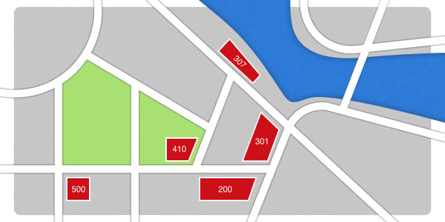

رموز الإجابة في HTTP
==================
كان ختام المقالة السّابقة قولُنا أن بروتوكول HTTP يدير التّفاعل بين عميل وخادوم، وقد شرحنا فكرة ترويسات HTTP. سيكون لدينا الكثير مما يُقال عن هذه الترويسات في أجزاء تالية من هذه السّلسلة، فهذه الترويسات تؤثّر في التّفاعل بين الطّرفين وفي أداء الموقع. أمّا اليوم، فسنطّلع على جانب لا يقلّ أهمّيّة عن التّرويسات، وهو رموز إجابات HTTP.

##نزهة في الشوارع


خرجت ذات صباح قاصدًا مقهى لأقرأ كتابًا، لكنّني وجدت المقهى مُغلقًا حينها، وقد كُتب على لوحة على الباب أنّ احتفالًا يُقام خلال هذا الأسبوع، ولذلك فإنّ المقهى سينتقل **مؤقتًا** ليُقدّم القهومة في شاحنة الطّعام (التي سمّوها "307") قرب النهر. ذهبت إلى ذلك المكان واستمتعت بشرب القهوة.

قرّرت بعدئذٍ التجوّل في مكتبتي المفضّلة في المدينة، فوجدتها مُغلقةً كذلك، إلّا أنّني رأيت لوحة على الباب تقول أن المكتبة ستتوسع ولذلك انتقلت **بشكل دائم** إلى مبنى جديد في 301 شارع برنرز-لي. لم يُزعجني ذلك، فالمكان قريب. ذهبت إلى هناك فاستقبلني الموظّفون بالتّرحاب: "**200** سلامة!". حسنًا، أنا أبالغ قليلًا، لكنّني فهمتني!

في طريقي إلى البيت، وجدت متجرًا مهجورًا غطّى الغبار أبوابه في 410 شارع برنرز-لي، وقد أُلصقت ورقةٌ على الباب تقول أنّ صاحب المحلّ تقدّم بطلب إشهار الإفلاس واضطّر إلى إغلاق المتجر، **إلى الأبد**. وكأنّ العجائب لم تنتهِ اليوم، إذ رأيت في نهاية 500 شارع برنرز-لي مبنى من 4 طوابق وقد انهار بالكامل. ما الذي حدث هنا؟!

لم يكن يومي سيئًا بالمجمل، لذا قرّرت أن أكمل يومي بكتابة مقال عن رموز HTTP الّتي تُرسلها الخواديم إلى العملاء الّذين يرسلون الطّلبات.

##صياغة جواب HTTP وسطر الحالة
تطرّقنا في المقال السّابق إلى السّطر الأول من صيغة الطّلبات الّتي يُرسلها العميل (بما في ذلك أفعال HTTP). وسنركّز الآن على السّطر الأول من رسالة الجواب الّتي تصل من الخادوم، ومعاني الرّموز المختلفة الّتي تظهر في هذا السّطر. لاحظ التّشابه بين نوعي الرّسائل (الطّلبات والإجابات). فكما ينصّ توثيق الإصدارة [1.1 من HTTP](https://tools.ietf.org/html/draft-ietf-httpbis-p1-messaging#section-3.1):

> إما إن تكون رسالة HTTP طلبًا من العميل إلى الخادوم أو جوابًا من الخادوم للعمل. من حيث الصّياغة، لا يختلف نوعا الرّسائل إلى في السّطر الأوّل، والذي إمّا أن يكون سطر طلب (للطلبات) أو سطر حالة (للإجابات)، وفي خوارزميّة تحديد طول متن الرّسالة (القسم 3.3).

يُدعى السّطر الأول في الجواب إذًا [سطر الحالة](https://tools.ietf.org/html/draft-ietf-httpbis-p1-messaging#section-3.1.2). يبدأ السّطر بإصدارة بروتوكول HTTP ثمّ مسافة ثم رمز من ثلاثة أرقام، ثم مسافة ثمّ جملة تشرح الرّمز، كهذا المثال:

```
HTTP/1.1 200 OK
```

الجملة القصيرة الأخيرة غير إلزامية وعلى العملاء تجاهلها، ولا ينبغي أن يستخدمها برنامج بغرض تفسير الجواب. لنطّلع الآن على بعض أكثر رموز الحالة شيوعًا وما يعنيه كلّ رمز منها.

##رموز الحالة في HTTP
###200، كلّ شيء على ما يرام!


في كلّ مرّة يريد شخصٌ ما زيارة الصّفحة الرئيسيّة لموقع Opera، يُرسل العميل طلبًا إلى `http://www.opera.com/` برسالة مثل هذه:

```
GET / HTTP/1.1
Host: www.opera.com
Accept-Language: fr
User-Agent: BrowseAndDream/1.0
```

يُحلّل الخادوم الرّسالة الّتي وصلته من العميل ويُرسل جوابًا بناء على ما فهمه من الرابط والترويسات. وكما ذكرنا في المقالتين السّابقتين، يكون الهدف الأهمّ هو إدارة التّواصل بين الطّرفين بما يحقّق أقصى فائدة لكليهما.

إن فهم الخادوم الرّسالة، فإنّه يرسل رسالة تبدأ بـ`200 OK`، أي أنّ كلّ شيء على ما يُرام. تحوي الرسالة بضع ترويسات إجابة ثمّ محتوى الصّفحة، والّذي قد يختلف بناءً على ترويسات الطّلب، فلا إجابة مُطلقة. فكما في كل تفاوض، يجري حوارٌ بين الطّرفين للوصول إلى أفضل تسوية. فيما يلي مثالٌ عن إجابة على الطّلب السّابق:

```
HTTP/1.1 200 OK
Date: Fri, 24 Aug 2012, 13:56:44 GMT
```

###307، انتقلتُ مؤقّتًا إلى مكان آخر


يمكن للخادوم أن يجيب العميل برسالة تبيّن أنّ المحتو قد انتقل مؤقتًا إلى مكان آخر. ويفيد هذا عندما تريد إعادة توجيه العميل إلى صفحة مُعيّنة لفترة قصيرة. افترض مثلًا موقعًا يُعطي توقّعات الطقس لتاييبي، وقد شبّ إعصار هائل مؤخّرًا فيها. سيكون من المفيد إعلام المُستخدمين بوقوع هذا الإعصار حتى هدوئه. قد يكون الطّلب مثل هذا:

```
GET /taiwan/weather/today HTTP/1.1
Host: meteo.example.org
```

قد يرغب الخادوم بإجابة العميل قائلًا: "سأنقلك إلى صفحة أخرى تُعطيك معلومات مفصّلة عن الأزمة الحاليّة في تاييبي". قد تبدو الإجابة مثل هذه:

```
HTTP/1.1 307 Temporary Redirect
Date: Fri, 24 Aug 2012, 13:56:44 GMT
Location: http://meteo.example.org/taiwan/weather/crisis
```

يتبع المتصفح عادةً الوجهة الجديدة المذكورة في سطر `Location`. يمكن أن يطلب الخادوم إعادة التّوجّه إلى نطاق آخر على الويب. وحالما تنتهي الأزمة، يمكن للخادوم إزالة إعادة التّوجيه. ينبغي ألّا يتذكّر العميل إعادة التّوجيه للأبد. فهذا مُهمّ في حالة الإشارات المرجعيّة وسجل التصفّح. من الممكن تصميم برنامج يُدير عمليّات إعادة التّوجيه هذه بطريقة مُفيدة.

لا يرى المُستخدم إعادة التّوجيه في معظم المتصفّحات، ولكن من الممكن إرسال متن مع جواب إعادة التّوجيه يعرض على المستخدم رسالة تحوي رابطًا للمكان الجديد يُسمح للمُستخدم بنقره.

###301، تغيّر العنوان بشكل دائم


عند إدارة المعلومات على موقع ويب، قد نحتاج إلى إعلام العميل (ومستخدميه) أن الصّفحة المطلوبة قد انتقلت بشكل دائم. ففي الشّركات، يُعاد تنظيم الأقسام أحيانًا بعد الاتّحاد مع شركة أخرى أو عند تغيّر الأولويّات. لنفترض مثلًا أن وحدة الآلات الكهربائيّة في شركة تقنية قد ضُمَّت إلى قسم الإلكترونيّات. وعندها يمكن إعادة توجيه عميل يطلب:

```
GET /section/electromech/about HTTP/1.1
Host: inc.example.com
```

إلى:

```
HTTP/1.1 301 Moved Permanently
Date: Fri, 24 Aug 2012, 13:56:44 GMT
Location: http://inc.example.com/section/electronic/about
```

الفرق بين الرمز `307` الّذي شرحناه في الفقرة السّابقة، والرّمز `301`، أنّ التّغيّر في العنوان دائم في حالة الرّمز الثّاني، وهي رسالة واضحة من الخادوم للعميل تطلب منه أن يُغيّر الإشارات المرجعيّة المحفوظة لديه إلى العناوين الجديدة. يمكن للمتصفّح تنفيذ ذلك من تلقاء نفسه أو بعد استشارة المستخدم.

لإعادة توجيه الروابط القديمة فائدتان مُباشرتان. الأولى هي كسب ثقة المستخدمين بموقعك، بأن تُبدي اهتمامك بالمُحافظة على المعلومات الّتي تستضيفها. والثّانية هي استقرار الموارد، فالمواقع الّتي تُعرف بمحافظتها على الرّوابط تكون أكثر احتمالًا لأن تُشير إليها مواقع أخرى على المدى البعيد، ممّا يزيد ترتيب الموقع في مُحرّكات البحث.

###410، وداعًا يا صديقي العزيز!


تحتاج بعض المواقع أحيانًا إلى إبلاغ العميل باختفاء المعلومات الّتي كانت موجودة على رابط مُعيّن للأبد. وقد يكون لهذا مُبرّراته. نحن نعلم أن الروابط الجيّدة لا تتعطّل؛ ولكنّ الرّمز `410 Gone` هو الوسيلة الوحيدة المناسبة لتعطيلها. لنكن أكثر دقّة: هذا الرّمز هة طريقة لإخبار المستخدمين أن المحتوى الّذي كان موجودًا من قبل على هذا الرابط قد حُذِفَ عمدًا. وهذا معناه أن الخادوم يطلب من العُملاء الّذي يقصدون هذا الرّابط **ألّا يتذكّروه**. ففي متصفّح يستخدم الإشارات المرجعيّة وسجّلات التّصفّح، يُعتبر هذا الرّمز إبلاغًا للمتصفّح بسلامة حذف هذا الرّابط. افترض شبكة اجتماعيّة يُطلب فيها الوصول إلى صفحة مُستخدم:

```
GET /people/jeanpaulsartres HTTP/1.1
Host: socialnetwork.example.com
```

قرّر المستخدم أن يُغادر شبكتك الاجتماعيّة ويُغلق حسابه، قد تُريد أن تُبلغ غيره من المستخدمين الّذين يطلبون صفحته من سجلّ المتصفّح أو إشاراته المرجعيّة:

```
HTTP/1.1 410 Gone
```

###500، يا للمصيبة!


قد يتعذّر على الخادوم إجابة الطّلب لسبب مجهول. لا يتدخّل HTTP على الإطلاق في تفاصيل عمل الموقع، مثل طريقة تخزين قواعد البيانات على الخادوم، أو كيف يجلب الخادوم البيانات ويُعالجها. ربّما توقّف الطّلب عند برنامج مُعيّن على الخادوم ولم يصل الجواب، وعندها يُبلغ الخادوم العميل ومستخدمه عن وقوع خطأ ما غير معروف بجواب مثل هذا:

```
HTTP/1.1 500 Internal Server Error
```

##استخدام سطور الحالة في الإجابات الّتي تُرسلها الخواديم
عند تصميم نظام لإدارة المحتوى، يكون من الضّروري فصل الطّبقات بصورة موارد وروابط إلى هذه الموارد، فهذا مُفيد عند إجابة طلبات العملاء بالمعلومات الصّحيحة، وتقديم المحتوى للبرامج أو للبشر هو شيء جوهريّ في صفة الخواديم. ولأنّ المعلومات تتغيّر وتتطوّر،فإنّ تصميم الخواديم بما يراعي هذه النّقطة يُعطيها مرونة أكبر. لا تهدف هذه السّلسلة إلى شرح تفاصيل تطبيق إجابات الخواديم من النّاحية البرمجيّة، ولكنّنا سنستعرض مثالين يُفيدان كنقطتي انطلاق، على الرّغم من أنّهما قد لا يُفيدان في حالة المواقع الضّخمة الّتي تضمّ آلاف الرّوابط.

###إعادة التّوجيه في Apache
في حال أردت إعادة توجيه _http://inc.example.com/section/electromech/about_ إلى _http://inc.example.com/section/electronic/about_، يمكن إضافة ملف .htaccess في جذر الموقع يحوي التّعليمات التّالية:

```
RewriteEngine On
RewriteBase /
RewriteRule ^/section/electromech/about /section/electronic/about [L,R=301]
```

مُلاحظة: هنالك طرق أخرى لتنفيذ هذا الغرض، كاستخدام httpd.conf أو قواعد البيانات أو من خلال النّصوص البرمجيّة... إلخ. واختيار الطّريقة المناسبة يعتمد على تصميم النّظام.

###إعادة التّوجيه في nginx
خادوم Nginx هو الآخر شائع الاستخدام، وخصوصًا على شبكات توفير المحتوى (CDNs). يمكن إعادة كتابة المثال السّابق لاستخدامه مع nginx:

```
server {
	listen 80;
	server_name inc.example.com;
	rewrite ^/section/electromech/about http://inc.example.com/section/electronic/about permanent;
}
```

##تصنيف رموز HTTP
تعرّفنا على بضع رموز HTTP فيما سبق، ولكنّها [أكثر من ذلك](https://tools.ietf.org/html/draft-ietf-httpbis-p2-semantics#section-4)، وبعض هذه الرّموز ذائع الصّيت مثل `404 Not Found`، وبعضها مغمور لا يُرى كثيرًا. وفي كلا الحالتين يمكن الاستعانة بالرّقم الأوّل للرّمز لأخذ فكرة عن معناه، كون هذا الرقم يُشير إلى العائلة الّتي ينتمي إليها الرّمز:

* `1xx` (بيان): وصل الطّلب، وتجري مُعالجته.
* `2xx` (نجاح): وصل الطّلب وفُهم وقُبل.
* `3xx` (إعادة توجيه): يُطلب إجراء تالٍ لإكمال الطّلب.
* `4xx` (خطأ من جهة العميل): صياغة الطّلب خاطئة أو يتعذّر تحقيقه.
* `5xx` (خطأ من جهة الخادوم): فشل الخادوم في تحقيق طلب يبدو سليمًا.

##الخلاصة
إلى هنا نكون قد وصلنا إلى نهاية دراستنا لرموز حالة HTTP. أحثّك على الاطّلاع على كلّ رمز والتّعرّف على فائدته. لبعض هذه الرموز تأثيرات خاصّة على التّخزين المؤقّت وعلى متن رسالة HTTP؛ سنُلقي نظرةً على التّخزين المؤقت لاحقًا.

##تذكّر
* تُرسل الخواديم رموز حالة HTTP لتزويد العميل بمعلومات سريعة عن الجواب.
* تؤثّر رموز HTTP في التّخزين المؤقّت ومُعالجة الرّوابط من جهة العميل.
* تُصنّف رموز HTTP ضمن عدّة مجموعات.

ترجمة (بشيء من التّصرّف) لمقال [HTTP: Response Codes](https://dev.opera.com/articles/http-response-codes/) لصاحبه Karl Dubosy.
