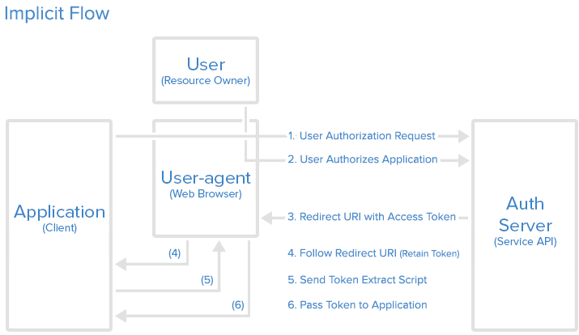

مدخل إلى OAuth 2
================
##تمهيد
‏OAuth 2 هو آليّة للتّرخيص تسمح للتطبيقات بطلب وصول محدود إلى حسابات المستخدمين في خدمات HTTP، مثل Facebook وGitHub وDigitalOcean. يعمل OAuth 2 بتوكيل الخدمة المستضيفة لحساب المستخدم باستيثاق هذا الحساب، ثمّ السّماح للتطبيقات الخارجيّة بالوصول إلى حساب المستخدم هذا. يوفّر OAuth 2 مسارًا لترخيص تطبيقات الويب وتطبيقات سطح المكتب والأجهزة المحمولة.

هذا الدليل موجّه لمطوّري التّطبيقات، وهو يُلقي الضّوء على أدوار OAuth 2 وأنواع الرُّخَص المتاحة، وكذلك يستعرض مجالات استخدامه وسير عمليّة التّرخيص.

لنبدأ بالتّعرّف على أدوار OAuth.

##أدوار OAuth
يُحدِّد OAuth أربعة أدوار:

* مالك المحتوى
* العميل
* خادوم المحتوى
* خادوم التّرخيص

سنُفصّل كلًّا من هذه الأدوار في الفقرات التّالية.

###مالك المحتوى: _المستخدم_
مالك المحتوى هو _المستخدم_ الذي يُرخِّص _لتطبيقٍ_ الوصول إلى حسابه. وصول التّطبيق إلى حساب المستخدم محدودٌ "بنطاق" (scope) الترخيص الممنوح (مثلاً: صلاحيّة القراءة والكتابة).

###خادوم المحتوى/التّرخيص: _الواجهة البرمجيّة (API)_
يستضيف خادوم المحتوى حسابات المستخدمين المحميّة، ويتحرّى خادوم التّرخيص هويّة _المستخدم_ ثمّ يمنح التّطبيق رمز وصول (access token).

من وجهة نظر مطوّر التّطبيقات، فإنّ **الواجهة البرمجيّة** للخدمة تؤدّي كلا الدّورين، دور خادوم المحتوى ودور خادوم التّرخيص. سنُشير إلى هذين الدّورين مجتمعين على أنّهما دور _الخدمة_ أو _الواجهة البرمجيّة_.

###العميل: _التّطبيق_
العميل هو التّطبيق الّذي يريد الوصول إلى حساب _المستخدم_، وقبل أن يستطيع ذلك، يجب أن يحصل على "ترخيص" المستخدم، وعلى هذا التّرخيص أن يُصادَق من الواجهة البرمجيّة.

##سير البروتوكول نظريًّا
بعد أن تعرّفنا على أدوار OAuth، دعونا نلقِ نظرةً على المخطّط التالي، والذي يبيّن كيف تتفاعل هذه الأدوار فيما بينها:


وفيما يلي شرح أكثرُ تفصيلًا للخطوات المُبيّنة في المُخطّط:

1. يطلب _التطبيق_ رخصةً للوصول إلى الخدمة من _المستخدم_
2. إن رخّص _المستخدم_ الطّلب، فإنّ _التطبيق_ يحصل على إذن بالتّرخيص
3. يطلب بعدها _التطبيق_ رمز وصول (access token) من _خادوم التّرخيص_ (الواجهة البرمجيّة) مُقدّمًا ما يُثبت هوّيته مع إذن التّرخيص الّذي حصل عليه.
4. إن كانت هويّة التّطبيق موثّقة وإذن التّرخيص سليمًا، أصدر _خادوم التّرخيص_ (الواجهة البرمجيّة) رمز وصول (access token) يمنحه للتّطبيق، لتكتمل حينئذٍ عمليّة الترخيص.
5. يطلب التّطبيق من _خادوم المحتوى_ (الواجهة البرمجيّة) المحتوى المطلوب، مُقدّمًا رمز الوصول الّذي حصل عليه.
6. إن كان رمز الوصول سليمًا، قدّم _خادوم المحتوى_ (الواجهة البرمجيّة) المحتوى المقصود _للتطبيق_

قد يختلف مسار العمليّة الفعليّ بحسب نوع الرّخصة المُستخدمة، ولكن هذه هي الفكرة العامّة. سنستعرض أنواع الرُّخَص المُختلفة في فقرة لاحقة.

##تسجيل التّطبيق
قبل استخدام OAuth في تطبيقاتك، عليك تسجيل التّطبيق في الخدمة المعنيّة. يجري التسجيل عادةً من خلال نموذج في قسم المُطوّرين أو الواجهة البرمجيّة في موقع الخدمة على الويب، حيث ينبغي عليك تقديم البيانات التالية (وربّما معلومات أخرى عن تطبيقك):

* اسم التّطبيق
* موقع التّطبيق
* رابط إعادة الّتوجيه (Redirect URL) أو الاستدعاء الرّاجع (Callback URL)

تُعيد الخدمة توجيه المستخدم إلى رابط إعادة التّوجيه الّذي توفّره بعد ترخيصه لتطبيق (أو رفضه)، وعليه فإنّ هذا الرابط هو المسؤول عن التّعامل مع رموز الترخيص أو رموز الوصول (access tokens).

###مُعرّف العميل وكلمة سرّ العميل
ستمنحك الخدمة بعد تسجيل تطبيقك "وثائق اعتماد العميل" المؤلّفة من _معرّف العميل_ و_كلمة سرّ العميل_. معرّف العميل هو سلسلة من الحروف مكشوفة للعموم تستخدمها الواجهة البرمجيّة للخدمة لتحديد هويّة التّطبيق، ولبناء روابط التّرخيص المُقدّمة للمستخدمين. أمّا كلمة سر العميل فتُستخدم للاستيثاق من هويّة التّطبيق بالنّسبة للواجهة البرمجيّة للخدمة عندما يطلب التّطبيق الوصول إلى حساب المُستخدم، ويجب أن تبقى سرّيّة بين التّطبيق والواجهة البرمجيّة.

##إذن التّرخيص
في فقرة "سير البروتوكول نظريًّا"، تبيّن الخطوات الأربع الأولى كيفيّة الحصول على إذن بالتّرخيص ورمز للوصول. يعتمد نوع الإذن على طريقة طلب التّطبيق للتّرخيص، وأنواع الأذون الّتي تدعمها الواجهة البرمجيّة. يعرّف OAuth 2 أربعة أنواع من أذون التّرخيص، يمكن الاستفادة من كلّ منها في حالات مُختلفة:

* **رمز التّرخيص (Authorization Code):** تستخدمه التّطبيقات الّتي تعمل على الخواديم
* **ضمنيّ (Implicit):** تستخدمه تطبيقات الويب وتطبيقات الأجهزة المحمولة (أي التّطبيقات الّتي تعمل على جهاز المُستخدم)
* **كلمة مرور مالك المحتوى:** تستخدمها التّطبيقات الموثوقة، كتلك الّتي تتبع للخدمة ذاتها
* **كلمة مرور العميل:** تستخدم في حالة الوصول للواجهة البرمجيّة للتّطبيقات

سنشرح أنواع الأذون وحالات استخدامها بالتّفصيل في الفقرات التّالية.

###الإذن من نوع "رمز الترخيص":
هذا النّوع من الأذون هو الأكثر استخدامًا لأنّه مُصمّم _للتطبيقات الّتي تعمل على الخواديم_، حيث لا يُكشف النّص المصدريّ للتّطبيق للعموم، وحيث يمكن الاحتفاظ بسرّيّة _كلمة سرّ العميل_ بصورة تامّة. ويعتمد سير التّرخيص هنا على إعادة التّوجيه، ممّا يعني أنّه على التّطبيق أن يكون قادرًا على التّفاعل مع _وكيل المستخدم_ (كمتصفّح الويب الّذي يستخدمه) وعلى استقبال رموز التّرخيص الّتي توفّرها الواجهة البرمجيّة والّتي تمرّ من خلال وكيل المستخدم.

سنشرح الآن سير عمليّة التّرخيص في هذا النّوع من الأذون:

####سير التّرخيص بالرّمز


#####الخطوة 1: رابط رمز الترخيص
يُعطى المُستخدم في البداية رابطًا لرمز التّرخيص يُشبه هذا:

```
https://cloud.digitalocean.com/v1/oauth/authorize?response_type=code&client_id=CLIENT_ID&redirect_uri=CALLBACK_URL&scope=read
```

فيما يلي شرحٌ لمكوّنات الرابط:

* **https://cloud.digitalocean.com/v1/oauth/authorize:** نقطة الوصول إلى قسم التّرخيص في الواجهة البرمجيّة

* **client_id=client_id:** مُعرّف العميل للّتطبيق (كيفيّة تحديد الواجهة البرمجيّة لهويّة التّطبيق)

* **redirect_uri=CALLBACK_URL:** المكان الّذي تعيد الخدمة توجيه وكيل المستخدم إليه بعد منح رمز الترخيص

* **response_type=code:** يُبيّن أنّ تطبيقك يطلب إذنًا بالحصول على رمز ترخيص

* **scope=read:** يُعيّن مستوى الوصول الّذي يطلبه المُستخدم

#####الخطوة 2: يُرخّص المستخدم التّطبيق
عندما ينقر المُستخدم الرّابط، يجب عليه أوّلًا تسجيل الدّخول إلى الخدمة، وذلك للتّحقق من هويّة المُستخدم (ما لم يكن قد سجّل دخوله من قبل). ثم تعرض عليه الخدمة _ترخيص_ أو _رفض_ وصول التّطبيق إلى حسابه. فيما يلي مثال عن صفحة ترخيص التّطبيق:


هذه الصّورة مُلتقطة من صفحة ترخيص DigitalOcean، ونرى فيها التّطبيق "Thedropletbook App" يطلب إذنًا بقراءة حساب المُستخدم "manicas@digitalocean.com".

#####الخطوة 3: يتلقّى التطبيق رمز التّرخيص
إذا نقر المُستخدم "Authorize Application"، فإنّ الخدمة تُعيد تحويل وكيل المستخدم إلى رابط إعادة التّوجيه الّذي حدّده التّطبيق أثناء تسجيل المُطوِّر له، وتُرفق الخدمة مع الرّابط _رمز التّرخيص_. مثال على الرّابط (مُفترضين أنّ التّطبيق هو "dropletbook.com"):

```
https://dropletbook.com/callback?code=AUTHORIZATION_CODE
```

#####الخطوة 4: يطلب التّطبيق رمز الوصول (Access Token)
يطلب التّطبيق من الخدمة رمز وصول، مُمرّرًا لها رمز التّرخيص مع تفاصيله، بما في ذلك _كلمة سرّ العميل_، والّتي تُرسل جميعها إلى رابط الحصول على رمز الوصول الخاصّ بالخدمة. فيما بلي مثال على طلب POST يُرسل إلى رابط رمز الوصول في DigitalOcean:

```
https://cloud.digitalocean.com/v1/oauth/token?client_id=CLIENT_ID&client_secret=CLIENT_SECRET&grant_type=authorization_code&code=AUTHORIZATION_CODE&redirect_uri=CALLBACK_URL
```

#####الخطوة 5: يتلقّى التّطبيق رمز الوصول
إن كان التّرخيص سليمًا، فإنّ الواجهة البرمجيّة تردّ على الطّلب بجواب يحوي رمز الوصول (مع رمز إعادة تجديد الرّخصة، غير إلزاميّ) إلى التّطبيق. يبدو الجواب مثل هذا:

```json
{"access_token":"ACCESS_TOKEN","token_type":"bearer","expires_in":2592000,"refresh_token":"REFRESH_TOKEN","scope":"read","uid":100101,"info":{"name":"Mark E. Mark","email":"mark@thefunkybunch.com"}}
```

أصبح التّطبيق الآن مُرخّصًا! وبإمكانه استخدام الّرمز للوصول إلى حساب المُستخدم عن طريق الواجهة البرمجيّة للخدمة، محدودًا بنطاق الوصول، إلى أن تنتهي مدّة الرّمز أو يُسحب التّرخيص. في حال أُصدر رمز إعادة تجديد الرّخصة (refresh token)، فبإمكان التّطبيق استخدامه للحصول على رمز وصول جديد في حال انتهى مدّة السّابق.

###الإذن الضّمنيّ
يُستخدم نوع الأذون **الضّمنيّ** في تطبيقات الويب (التي تعمل في المتصفح) وتطبيقات الأجهزة المحمولة، حيث يصعب ضمان سرّية _كلمة سرّ العميل_. يقوم هذا النّوع من الأذون على مبدأ إعادة التّوجيه أيضًا، إلّا أنّ رمز الوصول يُعطى لوكيل المُستخدم ليقوم بدفعه إلى التّطبيق، وبهذا قد يُكشف للمُستخدم وللتّطبيقات على جهازه. لا يتضمّن سير التّرخيص في هذا النّوع هوّيّة التّطبيق، بل يعتمد على رابط إعادة التّوجيه (الّذي سُجّل في الخدمة) للوصول إلى هذا الهدف.

لا يدعم هذا النّوع من الأذون رموز إعادة تجديد التّرخيص.

يسير التّرخيص في هذا النّوع كما يلي: يُطلب من المُستخدم ترخيص التّطبيق، ثمّ يُمرّر خادوم التّرخيص رمز الوصول إلى وكيل المُستخدم، الّذي ينقله بدوره إلى التّطبيق. إن كُنت مُهتمًّا بالتّفاصيل، فتابع القراءة.

####سير التّرخيص الضّمنيّ


#####الخطوة 1: رابط التّرخيص الضّمني
يُعرض على المُستخدم رابط التّرخيص، الّذي يطلب رمزًا من الواجهة البرمجيّة، يبدو هذا الرّابط مُشابهًا لرابط رمز التّرخيص، باستثناء أنّه يطلب رمز token بدلًا من code (لاحظ نوع الجواب المطلوب "token"):

```
https://oauth.example.com/authorize?response_type=token&client_id=CLIENT_ID&redirect_uri=CALLBACK_URL&scope=read
```

**ملاحظة:** لا تدعم DigitalOcean حاليًا التّرخيص الضّمني، لذا ذكرنا رابطًا وهميًّا "oauth.example.com".

#####الخطوة 2: يرخّص المُستخدم التّطبيق
عندما ينقر المُستخدم الرّابط، يجب عليه أوّلًا تسجيل الدّخول إلى الخدمة، وذلك للتّحقق من هويّة المُستخدم (ما لم يكن قد سجّل دخوله من قبل). ثم تعرض عليه الخدمة _ترخيص_ أو _رفض_ وصول التّطبيق إلى حسابه. فيما يلي مثال عن صفحة ترخيص التّطبيق:


نرى في الصّورة التّطبيق "Thedropletbook App" يطلب إذنًا بقراءة حساب المُستخدم "manicas@digitalocean.com".

#####الخطوة 3: يتلقّى وكيل المُستخدم رمز الوصول مع رابط إعادة التّوجيه
إذا نقر المُستخدم "Authorize Application"، فإنّ الخدمة تُعيد تحويل وكيل المستخدم إلى رابط إعادة التّوجيه الّذي حدّده التّطبيق أثناء تسجيل المُطوِّر له، وتُرفق الخدمة مع الرّابط _رمز الوصول_. مثال على الرّابط:

```
https://dropletbook.com/callback#token=ACCESS_TOKEN
```

#####الخطوة 4: يتبع وكيل المُستخدم مسار إعادة التّوجيه
يتبع وكيل المُستخدم رابط إعادة التّوجيه مع احتفاظه برمز الوصول.

#####الخطوة 5: يُرسل التّطبيق نصًّا برمجيًّا لاستخراج رمز الوصول
يُعيد التّطبيق صفحة ويب تحوي نصًّا برمجيًّا بإمكانه استخراج رمز الوصول من رابط إعادة التّوجيه الكامل الّذي احتفظ به وكيل المُستخدم.

#####الخطوة 6: يُمرّر رمز الوصول إلى التّطبيق
يُنفّذ وكيل المستخدم النّصّ البرمجيّ ويُمرّر رمز الوصول المُستخرَج إلى التّطبيق.

أصبح التّطبيق الآن مُرخّصًا! وبإمكانه استخدام الّرمز للوصول إلى حساب المُستخدم عن طريق الواجهة البرمجيّة للخدمة، محدودًا بنطاق الوصول، إلى أن تنتهي مدّة الرّمز أو يُسحب التّرخيص.

**ملاحظة:** لا تدعم DigitalOcean حاليًا التّرخيص الضّمني، لذا ذكرنا رابطًا وهميًّا "oauth.example.com".

###الإذن بالوصول إلى كلمة مرور مالك المُحتوى
في هذا النّوع من التّرخيص، يزوّد المستخدم التّطبيق مباشرةً باسم حسابه وكلمة مروره، ليستخدمها للحصول على رمز الوصول من الخدمة. يجب استخدام هذا النّوع من الأذون في الخوادم عندما لا تكون الأنواع الأخرى مُناسبة فقط. ويجب استخدامه فقط في حال كان التّطبيق موضع ثقة المُستخدم، كأن يكون تابعًا للخدمة ذاتها، أو أن يكون نظام التّشغيل على حاسوب المُستخدم هو ما يطلب الوصول.

####سير التّرخيص بالحصول على كلمة مرور المُستخدم
بعد أن يُعطي المستخدم كلمة مروره للتّطبيق، يطلب التّطبيق رمز الوصول من خادوم التّرخيص. يُشبه طلب POST ما يلي:

```
https://oauth.example.com/token?grant_type=password&username=USERNAME&password=PASSWORD&client_id=CLIENT_ID
```
إن كان اسم المُستخدم وكلمة المرور صحيحين، يُعيد خادوم التّرخيص رمز وصول للتّطبيق ويُصبح التّطبيق مُرخّصًا!

**ملاحظة:** لا تدعم DigitalOcean حاليًا التّرخيص بالحصول على كلمة المرور، لذا ذكرنا رابطًا وهميًّا "oauth.example.com".

###الإذن بالوصول إلى كلمة مرور العميل
في هذا النّوع من التّرخيص، يوفّر التّطبيق طريقة للوصول إلى حسابه الخاصّ على الخدمة. من الأمثلة الّتي يكون فيها استخدام هذا النّوع مُفيدًا أن يرغب التّطبيق بتحديث وصفه أو رابط إعادة التّوجيه المُسجّلين في الخدمة، أو أن يصل إلى بيانات أخرى حول حسابه على الخدمة عن طريق الواجهة البرمجيّة.

####سير التّرخيص بالحصول على كلمة مرور العميل
يطلب التّطبيق رمز الوصول مُرسلًا مُعرَّفه وكلمة مروره إلى خادوم التّرخيص، فيما يلي مثال عن طلب POST:

```
https://oauth.example.com/token?grant_type=client_credentials&client_id=CLIENT_ID&client_secret=CLIENT_SECRET
```

إن كان مُعرّف التّطبيق وكلمة مروره صحيحين، يُعيد خادوم التّرخيص رمز وصول للتّطبيق ويُصبح التّطبيق مُرخّصًا باستخدام حسابه الخاصّ!

**ملاحظة:** لا تدعم DigitalOcean حاليًا التّرخيص بالحصول على كلمة مرور العميل، لذا ذكرنا رابطًا وهميًّا "oauth.example.com". 

##مثال على استخدام رمز الوصول
بعد أن يحصل التّطبيق على رمز الوصول، إمكانه استخدام هذا الّرمز للوصول إلى حساب المُستخدم عن طريق الواجهة البرمجيّة للخدمة، محدودًا بنطاق الوصول، إلى أن تنتهي مدّة الرّمز أو يُسحب التّرخيص.

فيما يلي مثال عن طلب يُرسل للواجهة البرمجيّة للخدمة باستخدام `curl`، لاحظ أنّه يتضمّن رمز الوصول:

```
curl -X POST -H "Authorization: Bearer ACCESS_TOKEN""https://api.digitalocean.com/v2/$OBJECT" 
```

على فرض أنّ رمز الوصول سليم، فإنّ الواجهة البرمجيّة تُعالج الطّلب حسب ما صُمِّمت؛ وإلّا أعادت الواجهة خطأ "invalid_request"، كما يحدث عند انتهاء مدّة التّرخيص أو استخدام رمز خاطئ.

##سير الحصول على رمز إعادة تجديد الرُخصة
يؤدّي استخدام رمز وصول بعد انتهاء مدّة صلاحيّته إلى "خطأ رمز غير سليم (Invalid Token Error)". في هذه النّقطة، يمكن استخدام رمز إعادة تجديد الرّخصة في حال أُصدَر مع رمز الوصول للحصول على رمز وصول جديد من خادوم التّرخيص.

فيما يلي مثال على طلب POST للحصول على رمز وصول جديد مُستخدمين رمز إعادة تجديد:

```
https://cloud.digitalocean.com/v1/oauth/token?grant_type=refresh_token&client_id=CLIENT_ID&client_secret=CLIENT_SECRET&refresh_token=REFRESH_TOKEN
```

##الخاتمة
إلى هناك نكون قد وصلنا إلى ختام دليل OAuth. من المُفترض أن لديك الآن فكرة جيّدة عن البروتوكول وكيف يعمل، ومتى يمكن استخدام كلّ نوع من الأذون.

إذا أردت تعلّم المزيد عن OAuth 2، اطّلع على هذه المصادر القيّمة (بالإنكليزيّة):

* [How To Use OAuth Authentication with DigitalOcean as a User or Developer](https://www.digitalocean.com/community/tutorials/how-to-use-oauth-authentication-with-digitalocean-as-a-user-or-developer)
* [How To Use the DigitalOcean API v2](https://www.digitalocean.com/community/tutorials/how-to-use-the-digitalocean-api-v2)
* [The OAuth 2.0 Authorization Framwork](http://tools.ietf.org/html/rfc6749)

ترجمة (بشيء من التّصرّف) لمقال [Introduction to OAuth 2](https://www.digitalocean.com/community/tutorials/an-introduction-to-oauth-2) لصاحبه Mitchell Anicas.
