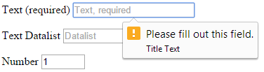
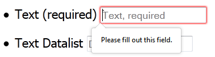
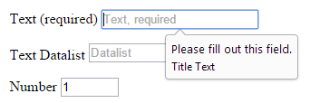
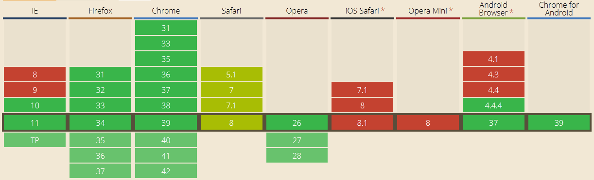
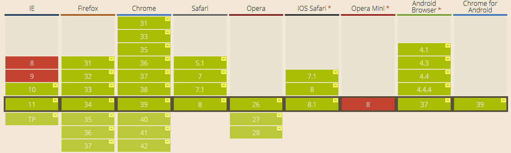

استخدام النماذج في HTML5 مع الأصناف الزّائفة (pseudo-classes) في CSS3
============================================================
سنتحدّث في هذه المقالة عن جزء مهمّ في CSS3 يعمل بشكل مُنسجم مع HTML5 وبالتحديد مع النماذج (forms)، تُشترط لهذا المقال معرفة مُسبقة بلغة HTML وCSS ومبادئ JavaScript، الموضوع ليس صعبًا وسنتناوله بشكل مُبسط.

نبذة عن الأصناف الزائفة
------------------
لكي لا يلتبس عليك الأمر أودُ الإشارة إلى أنّ كلمة pseudo (التي تعني "زائف") تُلفظ "سودو" وذلك لكي تَستطيعَ تمييزها في حال سماعك لها في شرح ما.

يُشير الصّنف الزائف إلى عنصر (element) موجود في البناء الهيكلي لمُستند HTML ولكن لا يُمكن الوصول إليه مباشرةً عبر خواص (attributes) محددة سابقًا، فمثلًا: يستهدف الصنف الزائف `‎:first-child` العنصر الأول الذي يلي العنصر الأب، وقد يكون العنصر الأول `<h1>` أو`<p>`، لذلك لا تستطيع استهدافه بشكل مباشر ولكن المتصفّح يَعرف طريقه إليه.

قدّم الإصدار 2.1 من CSS عددًا قليلًا من الأصناف الزّائفة، من بينها أوضاع الوصلات (link states)، وأيضًا تلك التي تُعبر عن أفعال المستخدم مثل `‎:active` و`‎:hover`؛ أمّا في الإصدار الثالث فقد ازداد عددها، وتوفّر منها ما هو مُرتبط بهيكل مُستند HTML مثل `‎:nth-of-type` و`‎:nth-child` ، وكذلك ما هو مرتبط مع الواجهة المرئيّة مثل `‎:checked` و`‎:enabled`، ومنها أيضًا ما يتعلّق بتدقيق النّماذج (form validation)، وهي موضوع مقالنا هذا.

تدقيق صلاحية النموذج بدون استخدام JavaScript
--------------------------------------
قدمت لنا HTML5 إمكانيّة تدقيق النّماذج ضمن المتصفّح (خلافًا للتّدقيق على الخادوم) بدون الاستعانة بلغة JavaScript، عندما تُحاول إرسال النموذج، سيُدقّق المتصفح كافة الحقول ويُظهر رسالة خطأ عند تعبئتها بشكل غير صحيح، هذا التصرّف تلقائيّ من المتصفّح إذا كان يدعم ذلك، وقد تختلف رسائل الخطأ هذه من متصفح إلى آخر ومن نظام تشغيل إلى آخر، وتعديلها ليس سهلًا نسبيًا، ولكن بإمكانك تغيير طريقة ظهور رسائل الخطأ على العناصر نفسها باستخدام الأصناف الزّائفة والتي تُصنّف ضمن [وحدة واجهة المستخدم الأساسية في CSS3‏](http://www.w3.org/TR/css3-ui/) (‏CSS Basic User Interface Module) وفق مواصفات W3C، تجد في الصور التالية كيف يعرض كل متصفح تنسيقًا مُختلفًا عن الآخر.







سأركز على دعم المتصفحات في القسم الأخير من المقالة ولكن باختصار أغلب المتصفحات تدعم تدقيق النماذج، والأمثلة في الصور التوضيحية التالية مأخوذة من متصفح Chrome، ويُفضل دائمًا متابعة التحديثات التي تطرأ على دعم المتصفحات بالاطلاع على على الموقع هنا، لنُباشر بالأمثلة العملية.

العناصر المطلوبة والاختيارية
---------------------
إن القيم المطلوبة (الإلزاميّة) واحدة من أشكال التدقيق الأكثر شيوعًا، وتُستخدم لتمييز الحقول التي يتحتّم على المستخدم تعبئتها لكي يتسنى له المتابعة، لجعل عنصر في نموذج مطلوبًا، أضف الخاصّة `required` إليه:
```html
<input type="text" required>
```
من ناحية المظهر، استخدم الصّنف الزائف `‎:required` الذي يستهدف العنصر الذي يملك الخاصة `required`، على سبيل المثال لِوضع علامة النجمة (*) بجانب عنوان الحقل، والتي عادةً ما تستخدم لتُشير إلى أن هذا الجزء من النموذج مطلوب وليس اختياريًّا اكتب التالي:
```css
input:required + label::after { content: "*"; }
```
تطبيق التنسيق السابق يعتمد على كيفية بناء مستند HTML فالمثال السابق يخص التالي:
```html
<input type="text" required id="foo">
<label for="foo">Foo</label>
```

يُستهدف الحقل الاختياري بالصّنف الزّائف `‎:optional` وبُطبق تأثيره على على كل عنصر لا يملك الخاصة `required`، مثلًا لجعلٍ حقل اختياري ذا حدود فاتحة نُطبق التنسيق التالي:
```css
input:optional { border-color: silver; }
```


العناصر السليمة وغير السليمة
-----------------------
لتدقيق النماذج أشكال أخرى بجانب `required` و`optional` تُمكنك من استخدام مطابقة الأنماط (pattern matching)، فمثلًا لِتدقيق عنوان البريد الإلكتروني:

```html
<input type="email">
```

عندما يقوم المُستخدم بإرسال مدخلات لا تُطابق نمطًا مُحدًدًا، يُعتبر المُدخل غير سليم، ولِتَنسيق عناصر النموذج السليمة وغير السليمة، تُستخدم الصّنفان الزائفان `:valid` و`:invalid` بالتّرتيب، وتُرسم إشارة تبعًا لسلامة المُدخل كما يلي:
```css
input:invalid + label::after { content: ' ⨉'; }
input:valid + label::after { content: ' ✓'; }
```
لاحظ أن هذا التنسيق يُطبقُ عند تحميل الصفحة لذلك يجب استخدام JavaScript لتطبيق التأثيرات عند إرسال النموذج، وذلك بإضافة صنف (class) إليه، في مثالنا سوف نضيف الصنف `submitted`:

```javascript
document.forms[0].addEventListener('submit', function(e) {
  e.currentTarget.classList.add('submitted');
});
```

قد يختلف النّص البرمجيّ الذي ستكتبه، ولكن كلّ ما عليك فعله هو تنسيق الصنف كما في التالي:
```css
.submitted input:invalid + label::after { content: ' ⨉'; }
```


مجالات الأرقام
------------
تسمح بعض أنواع الحقول مثل `number` بتحديد مجال من القيم باستخدام الخاصيات `min` و`max` كما في التالي:
```html
<input type="number" max="10" min="1">
```

في الحالة الطبيعية سيحدّ المتصفح مجال الأرقام تلقائيًّا بحيث لا يسمح للمستخدم بتجاوزه، ولكن إن أمكن تعديل هذه القيمة (باستعمال JavaScript مثلًا) لتتجاوز هذا المجال، فيمكن أن يُستخدم تنسيق خاص لإظهار الخطأ:
```html
<input type="number" max="10" min="1" value="11">
```

يُستخدم عندها الصنف الزائف `‎:out-of-range` وتنسيقه:
```css
input[type='number']:out-of-range { border-color: red; }
```

بعكس`‎:out-of-range` لدينا `‎:in-range` وتنسيقه:
```css
input[type='number']:in-range { border-color: green; }
```


القراءة والكتابة
-------------
يكون لديك في بعض الأحيان حقل نموذج مُدخل مسبقًا بقيمة لاتريد من المستخدم التعديل عليها كما في حقل `textarea` في اتفاقية الاستخدام مثلاً، يمكنك عندها إضافة الخاصة للقراءة فقط `readonly`.
```html
<textarea readonly>Lorem ipsum</textarea>
```

لتنسيق العناصر التي تحمل الخاصة `readonly` يُستخدم الصّنف الزّائف `‎:read-only` وبإمكانك أيضًا إضافة الخاصة `user-select` لِتمنع المستخدم من تحديد النص.

```css
textarea:read-only { user-select: none; }
```


ويُستخدم الصّنف الزّائف `‎:read-write` للعناصر الأخرى المسموح بتعديلها ويُنسق بالشكل التالي:
```css
textarea:read-write { user-select: text; }
```
لاحظ أنه قد تم تنسيق الحواف للتمييز، حيث بشكل افتراضي لا يوجد فرق في التنسيق بين الصّنفين الزّائفين `‎:read-only` و`‎:read-write`


دعمُ المتصفحات
------------
يُوضح الجدول التالي دعم المتصفحات لِتدقيق الموذج، تجد آخر تحديث للجدول [هنا](http://caniuse.com/#search=form-validation)، حيث يُلاحظ أن أغلب المتصفحات في آخر إصداراتها تدعم هذه الخاصة.



أما الجدول التالي فيُوضح دعم المتصفحات للأصناف الزّائفة، بالنسبة للدّعم الجزئي (partial support) لأشباه الأصناف، فيعني أنه عند استخدامها يجب إضافة البادئة `moz` لفيرفُكس و`ms` لـِIE و`webkit` لباقي المتصفحات، تجد آخر تحديث للجدول [هنا](http://caniuse.com/#search=pseudo-class)



‏HTML وCSS لغتان في تطوّر مُستمر وذلك من شأنه أن يُقلل من اعتمادنا على JavaScript، مما يُقلل حجم ملف `.js` (على حِساب ملف `.css`) المُرسل للمستخدم ومنه إلى سرعة نسبية في التصفح وتجربة استخدام أفضل، أرجو أنّ أكون قد وفقت في الشرح وقدّمت الفائدة المرجوّة من هذه المقالة، أنصحكَ بالتطبيق العملي لتركيز المعلومة، ولا تنسَ مشاركة المقالة.

_ترجمة -وبتصرف- للمقال: [CSS3 Pseudo-Classes and HTML5 Forms‏](http://html5doctor.com/css3-pseudo-classes-and-html5-forms) لصاحبه [Peter Gasston‏](http://twitter.com/stopsatgreen)._
